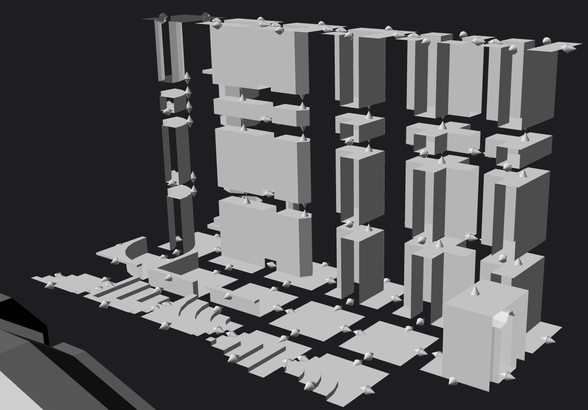

# Dungeon Maker

##Aims 
To create a procedurally generated level using a dungeon tool kit.

## Description

This project focuses on the level that we had imagined creating. At the beginning we had wanted to create a combination of large rooms and connecting hallways. However after some thought of the type of level we wanted to create, a different approach was adopted. We divided the project into two main chambers. Stairways and rooms. This allows us to create interesting levels in the theme of Hogwarts from the Harry Potter series.

## Technical Design 

When we had the idea of what we wanted the project to output we divided up the tasks into three main areas, stairs, rooms and artist input or world generation. After this was defined a project flow diagram and basic structure was created. Essentially we would handle a part of the process and pass the output on to the next person in the chain.

This diagram shows the basic structure of how the data passed through the system 

The tasks were divided up as follows: 
  - Witek to handle the artist input and overview of the level 
  - Louis to create rooms with interesting pillars and features 
  - Robert to implement the stairway generator to connect doors on multiple levels. 
  - Henry to create a web interface and run the tool on a server for users to control

## Stairs Overview 

For my section of the task I approached the creation of the stairways with a completely random connection of meshes. However after more consideration a more sophisticated implementation was needed so that a path was always created between the different doors. The A* path finding algorithm was chosen because of it tile based design. The 2D implementation discussed in Sebastian Lague tutorial on YouTube ( [Link to Tutorial](https://www.youtube.com/watch?v=-L-WgKMFuhE&t=581s) )  was the pseudo code used to create the 3D version of the algorithm. This approach was not easily converted to 3D and will be discussed in more detail in the explanation below. 

## A* path finding 3D Explanation

The A* path finding within this project was a very unrefined version which had undesirable outputs. This meant that some paths would stack stairs right on top of each other. This was mainly a result of changing the algorithm to 3 dimensions. However adding a waypoint system to the algorithm for it to split up the journey remedy some of the problem. 

The way the A* path finding works is to get the closest neighbouring tiles and calculate three values for each tile. The distance to the start, end and them combined. This is then sorted in the combined then end distance to find the most promising tile to calculate next. To keep the data stored the same I used a list of tuples in this format. open = [((Position of Tile), (GHF Costs), (Parent Position))]. This keep working with the loose format types in python easier to understand. 

After the next tile is chosen it repeats the step until it reacts the destination tile. From the Last tile it traces back the tiles using the parent position to get the chosen path back to the start. However in 2 dimensions this works we well because it has a limited amount of options to travel. But when in 3 dimensions it will always travel up first and then flat to its target. 

The way that the algorithm was changed was to include checking of one higher tiles then the current tile. This I have represented in the image below.  

Get Surrounding Tiles

The yellow cube is the current tile and the red and the surround tiles. 

## Components File 

In the initial design phases of this project we wanted to create an interesting level which would create rooms and stairs wells which are connected together without using really long corridors or tunnels. This meant we needed to add some components to the initial dungeon kit. 

Components Screenshot in Blender

At this stage a document was created as a reference of the types and names of connectors. Web link to Document: https://github.com/witold-gawlowski/dungeonmaker/blob/master/Classifcation_Dugeon_Generator.pdf . 

All of the additional models allowed Louis and myself to recreate the rooms or stairwells. However if we restarted this project we would change the components tile kit to enable better connections of rooms and stairs to walls. 

